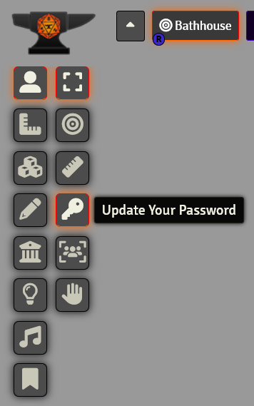
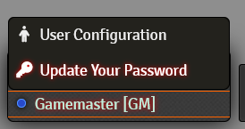
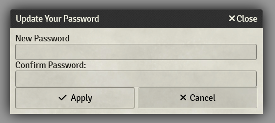
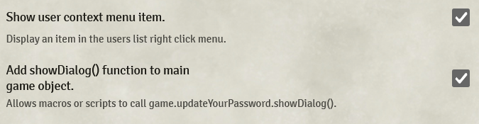

# Update Your Password

This module simply adds a new tool to the Token Controls menu or the user list right click menu which allows players to update their passwords while logged in.

Clicking it will show this very simple dialog.

Settings are available to toggle the visibility of both choices.

A password must be typed in twice to confirm before applying. If the two entered passwords do not match, an error will be shown and the password will not be changed.

- It will also prevent you from setting a blank password in this manner as the tabletop does not seem to react to updating the password to nothing.
  - If you want to remove a password, it must be done through the standard game master interface.
